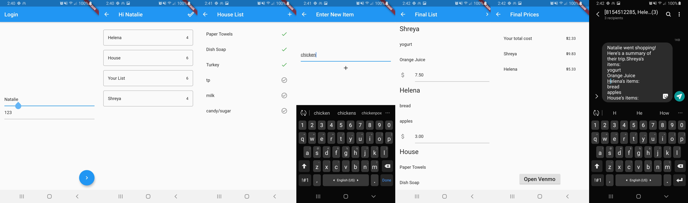

# PearlHacks 2020

PantryPals is an app made with flutter used to coordinate shopping needs amongst a house of roommate

# Example:

  

# Functionality
Ability to log in as a user in a house
View the shopping lists of all members in house
Check off items as purchased on all list
Add Items to your own list, or a house list
Calculate costs of who owes how much to whom
Send text to all parties who owe money

# Built with:
Flutter
Dart
Firebase

